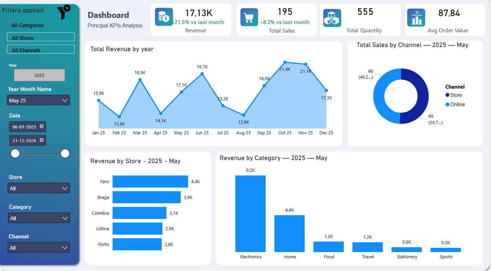
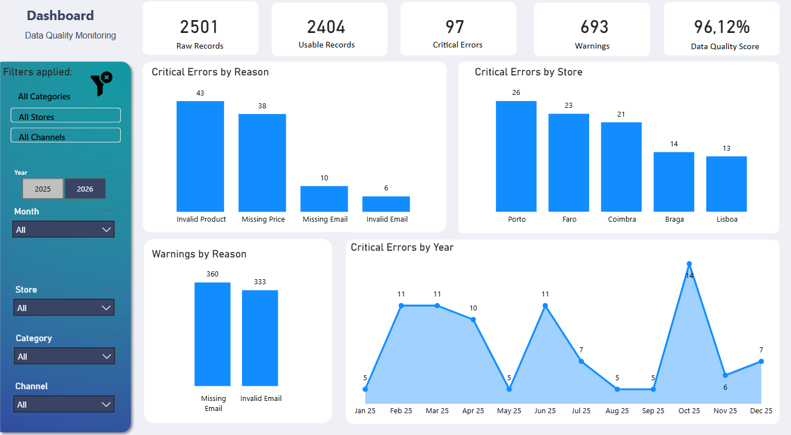
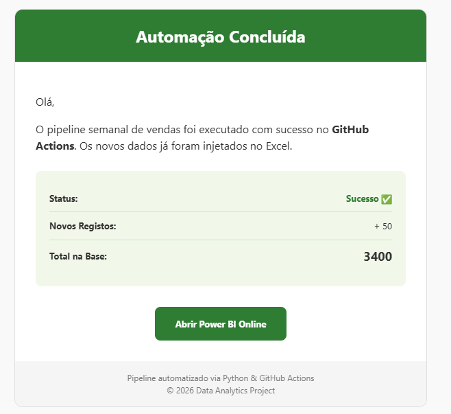

# Data Pipeline Workaround: Solving Automation without Premium Licenses

This project is a technical demonstration of how to overcome typical licensing and infrastructure barriers in Data Analytics. The goal was to create a self-updating Power BI dashboard without access to paid database services, dedicated gateways, or Microsoft Fabric licenses.

## The Challenge
In many professional scenarios, we lack the "perfect" tech stack. The challenge here was to maintain a Power BI Service dashboard updated automatically, using only free-tier tools and strategic integrations.

##  The Solution (The Workaround)
Since I couldn't use a standard SQL Server + Gateway setup, I "connected the dots" using an alternative pipeline:

- **Storage:** Used a **GitHub Repository** as a lightweight, version-controlled data store for Excel files.
- **Data Ingestion:** Developed a **Python** script to simulate and inject weekly sales data, ensuring referential integrity.
- **Orchestration:** Leveraged **GitHub Actions** as a free cloud orchestrator to run the script and update the repository weekly.
- **Connectivity:** Bypassed Microsoft's authentication hurdles by connecting Power BI to the GitHub API via Web Tokens and Raw URL mapping.
- **Monitoring:** Integrated an **SMTP/Gmail** alert system to provide status reports on each ingestion.

## GenAI Collaboration
This project was developed with the assistance of **Generative AI** as a "pair programmer." GenAI was fundamental in:
- Debugging complex API authentication errors (404/429 errors).
- Optimizing Python logic for data generation.
- Drafting professional HTML templates for automated reporting.

## Dashboard Preview

##  Tech Stack
- **Python** (Pandas, XlsxWriter)
- **GitHub Actions** (CI/CD / Orchestration)
- **Power BI** (Web Connectivity & DAX)
- **Gmail API** (Monitoring)

##  How to Setup
1. **GitHub Secrets:** Add `EMAIL_USER` and `EMAIL_PASS` to your repository secrets.
2. **Power BI:** Use the Raw URL from GitHub and set the Authentication to **Anonymous** (Privacy Level: Public) in Power BI Service.
3. **Actions:** The workflow is set to run every Monday, but can be triggered manually in the "Actions" tab.

---
*Note: This repository serves as a proof of concept for technical problem-solving and resource optimization.*
